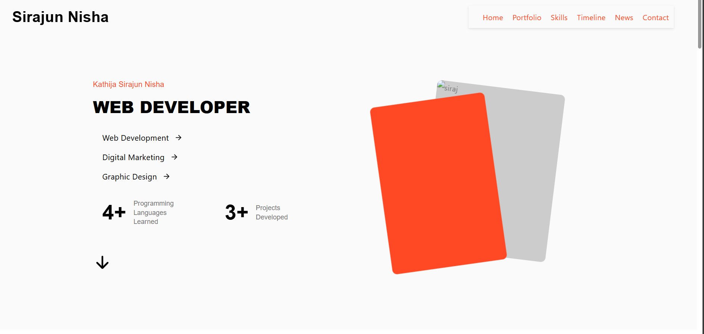
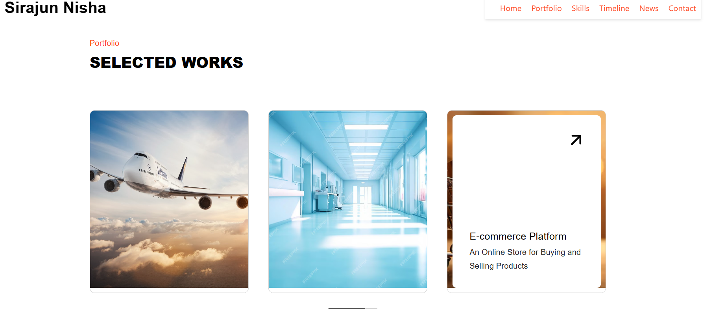

  
  
  
  
  
  

   
   

  <h2 align="center">ReactJS Portfolio Website</h2>

  This is a fully responsive personal portfolio website,  Built using **ReactJS** and styled with **CSS**.

  <a href="https://Sirabi08.github.io/Portfolio/"><strong>➥ Live Demo</strong></a>

 

### Demo Screenshots

### Prerequisites

Before you begin, ensure you have met the following requirements:

* [Git](https://git-scm.com/downloads "Download Git") must be installed on your operating system.
* [Node.js](https://nodejs.org/) and [npm](https://www.npmjs.com/) must be installed.

### Run Locally

To run **ReactJS Portfolio** locally, use these commands:

Linux and macOS:

sudo git clone https://github.com/Sirabi08/Portfolio.git
cd Portfolio
npm install
npm start

Windows:

git clone https://github.com/Sirabi08/Portfolio.git
cd Portfolio
npm install
npm start

### Contact

If you want to contact with me you can reach me at [Twitter](https://www.twitter.com/siraj086).

### License

This project is **free to use** and does not contains any license.
